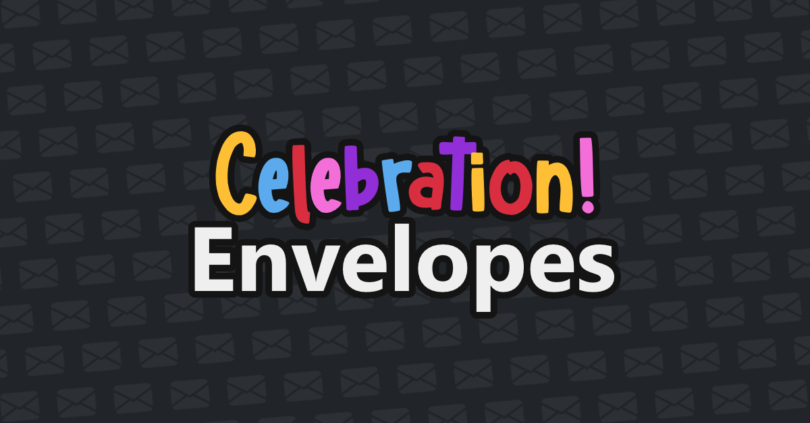

# Celebration Envelopes!

#### Video Demo:  [Youtube Video](https://www.youtube.com/watch?v=5dXbSk2wJAI)
#### Description:
An app to celebrate almost anything,
right now it has best support for birthday celebrations, but you can customize it a lot.

This is the perfect app if you want to congratulate someone, you can change the greeting,
name, message, song and confetti, the confetti is one of the most customizable parts of the app,
you can change the confetti shape, color and fall style.

1. Create a celebration envelope using the template.
2. Fill out the form.
    * **Greeting:**
        The text before the name, ***Happy birthday*** Carl!
        May be 25 characters long and contain latin and numeric characters, underscores and spaces.

    * **Name of Receiver:**
        The name of the person, Happy birthday ***Carl***!
        May be 50 characters long and contain latin and numeric characters, underscores and spaces.

    * **Message:**
        The message you want the person that receives the envelope to read, it's normaly a paragraph or longer.
        May be 250 characters long and contain latin and numeric characters, underscores and whitespace.

    * **Conffeti:**
        The small icons that fall, you can change their color, shape and falling style.
        You can have from one to six colors.
        The shapes available are Confetti, Graduation cap, Gift, Heart, Christmas ornament, Jack-o'-lantern.
        The fall styles available are Rain, Showers, Jump, Poppers or you can choose to disable confetti with None.

    * **Song:**
        Use a song from the presets or use a download link for any.
        The premade song links are `Happy Birthday`, `Happy Birthday (Version Reggaeton)`, `Thalía - Quinceañera`, `Vicente Fernandez - Las Mañanitas`, `Ismael Gallegos - En Tu Día`.
        The file has to be mpeg (mp3, m4a, acc, mpga).
        You can also use custom songs and audios the url has to be a donload link for the media though, the easiest way to make one is to record some audio or download a song in the supported formats then upload it to drive and use the tool linked on the song section to transform the drive share url into a download link.

3. Create it and share the link or make a QR Code.
4. Congratulate your friends, family or anybody you want!
